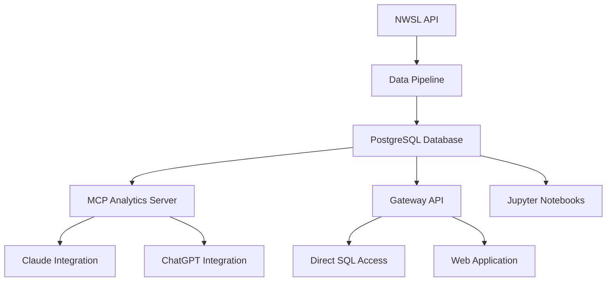

# System Architecture

NWSL Data is built as a comprehensive analytics platform with multiple interconnected services that work together to provide powerful soccer analytics capabilities.

## Overview

## Core Components

### Data Pipeline (`nwsl-loader`)
Extracts and processes match data from the NWSL API into structured analytics tables.

- **1,092 matches** identified across all seasons (2013-2025)
- **660 matches** fully processed with complete event data
- **558K events** with spatial coordinates and detailed qualifiers
- **770 unique players** auto-discovered from match data

### Database (PostgreSQL)
Comprehensive soccer analytics database hosted on Google Cloud.

- **Event data** partitioned by year for performance
- **Player registry** with performance metrics
- **Advanced analytics** tables (xG, VAEP, formations, spatial analysis)
- **Real-time updates** as new matches are processed

### MCP Analytics Server (`nwsl-mcp`)
Specialized analytics engine with 14 different analysis tools.

- **Spatial analysis** - Shot patterns, positioning, field zones
- **Player intelligence** - Individual performance in context
- **Tactical analysis** - Formation effectiveness, game situations
- **Temporal patterns** - When teams score, game flow analysis

### Gateway API (`nwsl-api`)
Dual-purpose API providing both direct database access and intelligent analytics.

- **SQL endpoint** for data scientists and developers
- **Natural language** queries routed through AI analytics
- **Security features** - read-only access, query validation
- **Performance** - connection pooling, query optimization

### Web Application (`nwsl-nextjs-web`)
User-friendly frontend for accessing NWSL analytics.

- **Next.js** application with modern UI
- **Interactive** data exploration and visualization
- **Notebook integration** with downloadable Jupyter files
- **Responsive** design for desktop and mobile

## Data Flow

1. **Collection**: Automated pipeline extracts match data from NWSL API
2. **Processing**: Raw JSON (~985KB per match) transformed into structured analytics
3. **Storage**: Data stored in PostgreSQL with optimized schemas for analytics
4. **Access**: Multiple interfaces (AI chat, API, web app, notebooks) query the same data
5. **Analysis**: 14 specialized analytics tools provide deep soccer insights

## Infrastructure

- **Google Cloud Platform** for hosting and compute
- **PostgreSQL 17** database with advanced indexing
- **Docker containers** for consistent deployment
- **GitHub Actions** for automated documentation deployment
- **Cloud Run** for scalable API hosting

## Security & Performance

- **Read-only** database connections for all public access
- **Query validation** and SQL injection protection
- **Rate limiting** and timeout controls
- **Connection pooling** for optimal database performance
- **Caching** for frequently accessed analytics

This architecture enables NWSL Data to serve everyone from casual fans asking simple questions to data scientists building advanced models, all from the same comprehensive dataset.